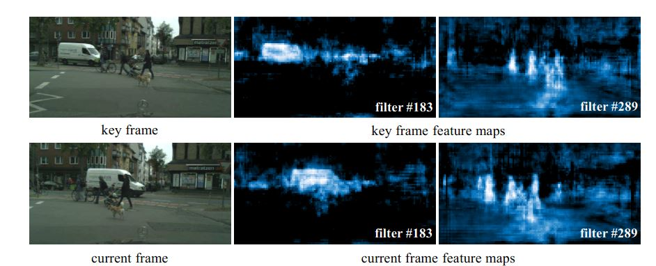
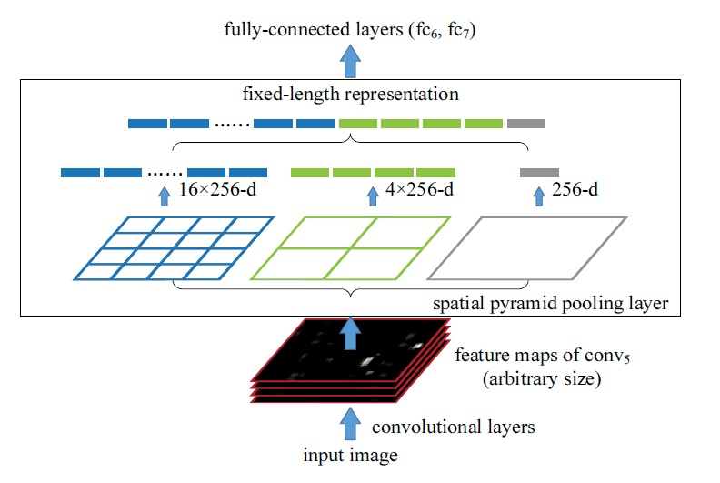
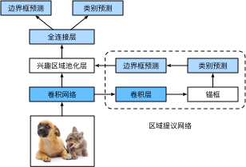
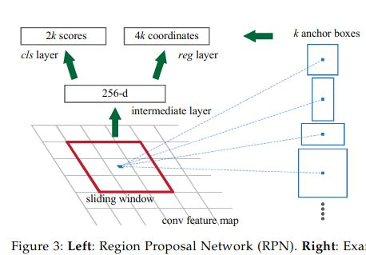

# 两阶段方法

我们这里只梳理算法的主要工作，不说细节。

## R-CNN

R-CNN的框架对后续算法影响十分的大,其主要贡献在于采用了预训练好的卷积神经网络来对抽取特征，取得了比较好的精度。

1. 首先利用Selective Research选择出图片上可能有目标的候选区域。
2. 选择一个预先训练好的卷积神经网络，去掉最后的输出层作为提特征提取模块。将候选区域resize成卷积网络需要的输入尺寸，然后提取特征。
3. 将每个提议区域的特征连同其标注做成一个样本,训练多个支持向量机(SVM)来进行目标类别分类,这里第 i 个 SVM 预测样本是否属于第 i 类。(注意这里是n个独立的SVM分类器)
4. 在这些样本上训练一个线性回归模型来预测真实边界框。

[pdf: rcnn](./DET1_girshick2014rich.pdf)

## SPPNet 和 Fast R-CNN

R-CNN的主要性能瓶颈在于每个候选区域，都要做一次网络的前向计算,Fast R-CNN 的主要改进是根据图片的feature map保持空间位置的相对一致性，引入ROI的映射和pooling。

主要改进：
1. 用来提取特征的卷积网络是作用在整个图像上,而不是各个提议区域上。而且这个卷积网络通常会参与训练,即更新权重。
2. 选择性搜索是作用在卷积网络的输出上,而不是原始图像上。
3. 在 R-CNN 里,我们将形状各异的提议区域变形到同样的形状来进行特征提取。Fast R-CNN则新引入了兴趣区域池化层(Region of Interest Pooling,简称 RoI 池化层)来对每个提议区域提取同样大小的输出以便输入之后的神经层。
4. 在目标分类时,Fast R-CNN 不再使用多个 SVM,而是像之前图像分类那样使用 Softmax 回归来进行多类预测。

[pdf: fast-rcnn](./Girshick_Fast_R-CNN_ICCV_2015_paper.pdf)

实际上RoI pooling就是SPPNet只有一层的情况。
关键在于feature map的映射和ROI pooling

### 1. feature map的映射

为了说明这个，从dff盗一张图

图中是关键/非关键帧的特征图的可视化，可以看到#183卷积核学习到的可能是车的特征，#289卷积核学习的可能是行人的特征，关键是，你会发现卷积特征的位置和原图的位置是相关的，可以说是相对应的。

这就是feature map 映射操作的基础，我们之前要从一张图中抽取候选框，然后再计算feature 现在 **原始图像的框，可以对应于卷积图像相同位置的框** 因此我们只需要对整张图提取一次卷积，然后根据原图的候选框选择，在卷积图上找到对应，就可以节省大量的计算。

### 2. ROI pooling

ROI的作用，就是不管你输入多少，我的输出数目都是固定的。

SPPNet就是对一张图做不同尺度的ROI 然后把特征顺序连接起来,这样不管你输入图片多大尺寸，我输出的特征都一样长

详细请参考论文：
[pdf: SPPNet](./SPPNet.pdf)
或我在别处的说明[[ROI]](../feynman/ROI.md)

###  分类和回归

>Then,for each object proposal a region of interest (RoI) pooling layer extracts a fixed-length feature vector from the feature map. Each feature vector is fed into a sequence of fully connected (fc) layers that finally branch into two sibling output layers: **one** that produces softmax probability estimates over K object classes plus a catch-all "background" class and **another** layer that outputs four real-valued numbers for each of the K object classed. Each set of 4 values encodes refined bounfding-box positions for one of the K classes.

于是我们可以知道，RoI pooling后分别连接了softmax分类器和bbox offset回归器

## Faster-RCNN

Faster-RCNN提出了RPN网络，终于，Region Proposal也由网络来完成了

为此，[[pdf: faster-rcnn]](./Faster%20R-CNN.pdf)
引入了anchor、和RPN的概念

Faster-CNN论文说的很清楚，他的工作分成两块，前面是RPN，后面是Fast-RCNN。
前面的RPN proposal regions 给后面的 Fast R-CNN用。

RPN网络的结构直接看论文3.1章节会比较清楚,论文在介绍和实现的时候稍微有点不同，比如实现的时候全连接换成了卷积,不影响理解。

###　RPN

>A Region Proposal Network (RPN) takes an image (of any size) as input and outputs a set of rectangular object proposals, each with an objectness score.

实际上RPN的关键部分是在feature map上完成的,也就是首先由提特征网络得到feature map,然后一个小的卷积网络(sliding window)在feature map上进行特征提取(划窗,对feature map的每一点都进行),小网络的输入是$n \times n$大小的feature map输出是一个固定长度的特征向量(如果是VGG提特征就是512-d,ZF是256-d).

经过一系列的卷积和池化,feature map的尺寸变小了,fmap每个像素都对应着原图里一块区域,以每个像素为中心,产生$k$个先验的锚框(anchor),每个锚框由不同的大小和比例

对于每个anchor,根据其尺寸和特征向量分支出两个全连接层: cls-layer 和 reg-layer
1. cls-layer 输出是bool,用于判断这个Proposal有没有object(是前景还是背景)
2. reg-layer 输出有四个,用于预测proposal的中心锚点对应的(x,y,w,h)

因此图中分别是4k和2k的输出

然后后面接RoI pooling

再总结一下RPN

1. 卷积网络抽取的特征首先进入一个填充数为 1、通道数为 256 的 3 × 3 卷积层,这样每个像
素得到一个 256 ⻓度的特征表示。
2. 以每个像素为中心,生成多个大小和比例不同的锚框和对应的标注。每个锚框使用其中心
像素对应的 256 维特征来表示。
3. 在锚框特征和标注上面训练一个两类分类器,判断其含有感兴趣目标还是只有背景。
4. 对每个被判断成含有目标的锚框,进一步预测其边界框,然后进入 RoI 池化层。

感兴趣可以自己实现一下anchor的生成[[anchor]](../feynman/RPN_anchor.md)
