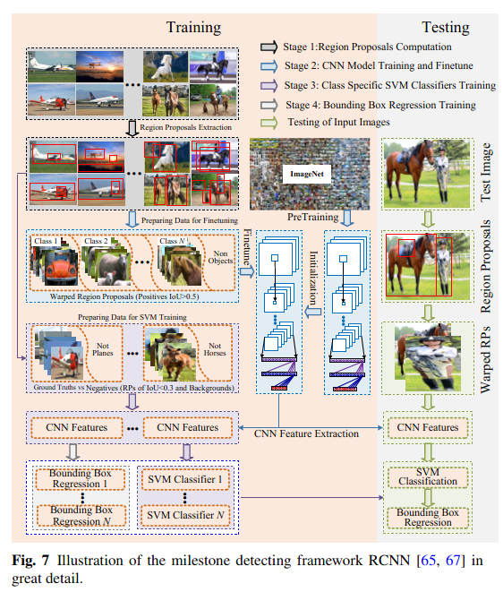
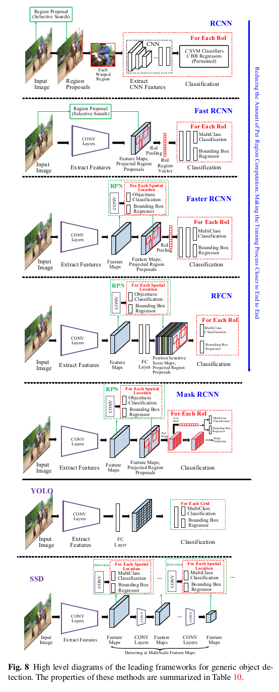

Deep Learning for Generic Object Detection: A Survey

Section 3

# Section 3 Framework

目标特征表示和分类器检测领域，随着手工特征向深度卷积网络学习特征的转变，大步流星的向前迈进着。

相比之下，即使有了一些新工作的出现，目标检测仍是以“划窗”策略为主流。
然而随着图像像素的增加，需要检测的划窗数目也指数级的陡增,图像的多尺度和多样的长宽比也加重了搜索任务。于是检测的计算量在不断上升，对算法的效率提出了更高的要求。由此，模型串联、特征值共享、减少前置窗口计算量等方式就被吸收进各种模型中。

基本上近几年的检测算法都是在一些里程碑意义的算法基础上某些方面的改进，
里程碑意义的检测算法架构总结：

总得来说，这些检测算法能够被分为两大类：

>A. Two stage detection framework, which includes a pre-processing step for region proposal, making the overall pipeline two stage.

>B. One stage detection framework, or region proposal free framework, which is a single proposed method which does not separate detection proposal, making the overall pipeline singlestage.

# 3.1 Region Based (Two Stage Framework)

基于区域的框架中，首先从图像中生成与类别无关的区域建议，然后提取区域的CNN特征，最后用一个类别特定的分类器得到区域的类别。DetectorNet，OverFeat，MultiBox and RCNN.

## RCNN

结合了CNN在图像分类上的成功 + 候选框推荐在手工特征上的成功
AlexNet + region proposal method [209]

>如上图，training in an RCNN framework consists of multistage pipelines:
>1. Class-agnostic region proposals, which are candidate regions that might contain objects, are obtained selective search [209];
>2. Region proposals, which are cropped from the image and warped into the same size, are used as the input for finetuning a CNN model pre-trained using large-scale dataset such as ImageNet;
>3. A set of class specific linear SVM classifiers are trained using fixed length features extracted with CNN, replacing the softmax classifier learned by finetuning.
>4. Bounding box regression is learned for each object class with
CNN features.

1. 类别无关的区域推选，
RCNN也有很多显著缺点

## SPPNet

在实践中发现，RCNN检测流程中的主要瓶颈还是CNN特征提取环节，对数以千计warped区域的特征提取计算量很大。
于是He 等人在RCNN算法中引入了 spatial pyramid pooling (SPP) 结构。卷积层的输入可以是任意尺寸的图片，而有固定输入的只有全连接层（FC），通过将SPP连接到卷积层的后面，可以对任意尺寸图像输出固定尺寸特征给FC层。

## Fast RCNN

相比RCNN/SPPNet独立训练后端的分类器，Fast RCNN 能够在region proposal后端 学习一个一体的分类器。

FastRCNN采用了基于跨区域的卷及计算共享的方法，还在卷积层和全连接层中间加入了一个 Region of Interest (ROI)层,来获取基于每个Region的固定长度大小的特征。
实际上，RoI池化用特征级的弯曲来近似图像级的弯曲。

而经过RoI处理的特征图将以向量的形式被喂到最后的FC层，并最终形成两个输出层：基于物体检测的Softmax概率模型和用于方法调整的特殊类别的Box回归模型。

对比RCNN和SPPNet，FastRCnn大大提高了效率，大约在训练过程中提速了2倍，在测试过程中提速了9倍。总而言之，FastRCNN拥有更高的物体检测准确度、能够更新网络所有权值的单阶段训练过程以及不需要额外的特征存储空间。

## FasterRCNN

尽管FastRCNN拥有较为出色的物体检测效率，但是它始终依赖着额外的Region Proposals，这也因此成为FastRCNN最大的瓶颈，最新研究表明，CNNs能够在最后一层卷积过程中很好的对物体进行定位，而在FC层中，这种能力稍欠。因此Region Porposals的选择性研究完全可以用CNNs进行代替，于是FasterRCNN应运而生.

Ren 等人 [175, 176] 提出了一个Region Proposal Network (RPN) 用于生成候选框。
FasterRCNN利用单个网络完成RPN提取Region Proprsals的任务，然后利用Fast RCNN进行目标分类。

在Faster RCNN中，RPN网络和fast RCNN共享了许多卷积层。 从共享卷积层输出的特征既用于region proposal，又用于region classification。

后面还有一些细节这里不表了。

## RFCN (Region based Fully Convolutional Network)

相比Fast RCNN, Faster RCNN 已经要快上一个数量级了, 然而他的计算量还是大， 因为每个RPN网络提的候选框都要由RoI层计算， 一帧图要进行几百次RoIs 运算。

RFCN 去掉了隐藏的全连接层， 是一个全卷积网络。 它和Faster RCNN 唯一不同的就是 RoI网络。 在Faster RCNN中，在ROI池化层之后的计算是不能够进行共享的，一个自然的想法是让无法共享的计算量尽量减少。  于是Dai 等人提出利用全卷积网络构建一个共享的RoI子网络，以及在预测前从最后一层卷积中取走ROI部分。 然而这样的操作降低了检测准确率，于是他们又观察了一下，操作了一下，又好用了。

//。。。这部分看不懂了 看算法原文章吧。。。

## Mask RCNN

Mask RCNN是Faster RCNN的拓展，能够给出像素级的目标实例分割。
它的流程也是同样是两阶段，而且第一阶段也是RPN，第二阶段模型在对每个RoI预测目标的类别和窗口的同时，多了一个分支计算二值mask。

为了避免原始ROI池化层所带来的失衡，于是研究人员提出了整合ROI的概念，将其用于保存像素级别的空间上的信息互通，在以Res Ne Xt101-FPN网络为主体网络架构的Mask RCNN网络达到了在COCO数据集上的物体实例分割和边缘物体检测最好的效果，总而言之Mask RCNN是一个训练简单, 推广容易, 并与FasterRCNN相比仅仅只增加一个小的开销的网络模型,而且其运行速度在 5fps左右 [1]

## Light Head RCNN

为了加速RFCN， Li等提出了Light Head RCNN。
顾名思义，轻量化了检测网络以减少RoI的计算量。 具体来说，Li等人应用了一个大的内核可分离卷积, 以产生小通道数和更轻量级的 RCNN 子网,使得在实验过程中形成了在速度和精确度之间的良好的平衡状态。

# 3.2 Unified Pipeline (One Stage Pipeline)

[1]: https://blog.csdn.net/AliceLeeHX/article/details/82726792?utm_source=copy "参考了"