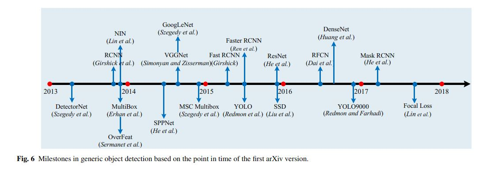
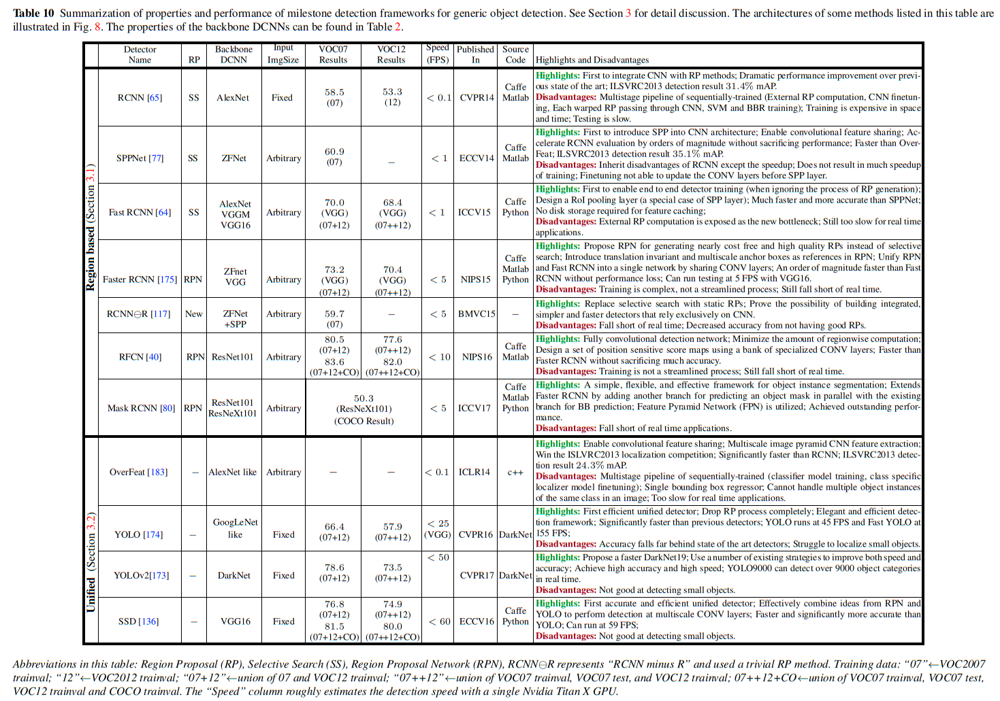

---

title: read det survey<liu2018deep> (三)

---

Deep Learning for Generic Object Detection: A Survey

Section 3

# Section 3 Framework

目标特征表示和分类器检测领域，随着手工特征向深度卷积网络学习特征的转变，大步流星的向前迈进着。

相比之下，即使有了一些新工作的出现，目标检测仍是以“划窗”策略为主流。
然而随着图像像素的增加，需要检测的划窗数目也指数级的陡增,图像的多尺度和多样的长宽比也加重了搜索任务。于是检测的计算量在不断上升，对算法的效率提出了更高的要求。由此，模型串联、特征值共享、减少前置窗口计算量等方式就被吸收进各种模型中。

基本上近几年的检测算法都是在一些里程碑意义的算法基础上某些方面的改进，
里程碑意义的检测算法架构总结：

总得来说，这些检测算法能够被分为两大类：

>A. Two stage detection framework, which includes a pre-processing step for region proposal, making the overall pipeline two stage.

>B. One stage detection framework, or region proposal free framework, which is a single proposed method which does not separate detection proposal, making the overall pipeline singlestage.

## 3.1 Region Based (Two Stage Framework)

## 3.2 Unified Pipeline (One Stage Pipeline)

