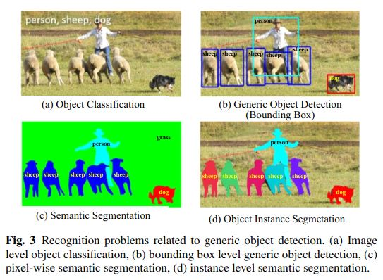

---

title: read det survey<liu2018deep> (二)

---
这一章主要定义、挑战、历史问题

Deep Learning for Generic Object Detection: A Survey

Section 2

# 2.1 问题重述

文章开头，认为通常说的目标检测有两大类，其任务有稍微不同 [1][1]  [2][2]

*   detection of specific instance 
*   detection of specific categories

>The first type aims at <b>detecting instances of a particular object (such as Donald Trump’s face, the Pentagon building, or my dog Penny)</b>, 

>whereas the goal of the second type is to <b>detect different instances of predefined object categories (for example humans,cars, bicycles, and dogs).</b>

>Historically, much of the effort in the field of object detection has focused on the detection of a single category (such as faces and pedestrians) or a few specific categories.
In contrast, in the past several years the research community has started moving towards the challenging goal of building general purpose object detection systems whose breadth of object detection ability rivals that of humans.

然后文章在2.1中对目标类别检测进一步说明：

>Generic object detection (i.e., generic object category detection), also called object class detection [240] or object category detection, is defined as follows. 

>Given an image, the goal of generic object detection is to determine whether or not there are instances of objects from many predefined categories and, if present, to return the spatial location and extent of each instance. It places greater emphasis on detecting a broad range of natural categories, as opposed to specific object category detection where only a narrower predefined category of interest (e.g., faces, pedestrians, or cars) may be present. 

给定一张图片，通用目标检测的目的是检测其中是否存在预训练类别实例，如果有，返回每个实例的空间位置和范围。

目标类别检测关心的目标类别更广，它想实现图像中出现的所有实例类别的检测，而不仅仅是针对人脸、行人、汽车等。但是关心的更多是有形状、结构的目标（而不是云彩、天空这样的）。

对于返回的实例位置和范围信息，目前最多用的表示就是bounding box。目前也有其它形式，比如像素级分割，实例分割。越来越精细化的结果是未来的趋势。

   
# 2.2 主要挑战

通用目标检测的理想是能够 提出出一个 在图像上定位并识别出 很多类别目标 的通用目标检测器，而且兼备**准确**和**高效**的优点。

## Accuracy

挑战主要来自于：

1. the vast range of intraclass variations 
2. the huge number of object categories

类内多样和类别多样

对于1，包括固有原因和图片质量。
前者是说同一类别的目标，可能在颜色、质地、材料、形状和尺寸上相差极大。比如椅子。
后者是说不同的拍摄条件（时间、位置、天气、相机、背景、照明、视角、视距、姿态、遮挡、阴影、模糊、运动）等等

对于2，我们的生活中，出现在视野内的目标类别非常多，又快又好的检测大量的类别的难度可想而知。

## Efficiency 

社交网络，智能手机与穿戴设备产生了海量视觉数据，然而智能手机和穿戴设备的计算能力和存储空间都是很有限的，因此需要目标检测算法的高效。

挑战主要来自于 类别的多样

# 2.3 过去20年

[//]: #(说一下梗概，具体文献看论文吧。)

## from past to 1990s

最初依托模板匹配，或检测目标具体部位，比如某人的人脸

然后是几何表示(geometric representations )

很快注意力转到分类器(NN,SVM,Adaboost)+图像特征

## 1990s to early 2000s 

出现了里程碑的算法 SIFT 和DCNN

特征表示从全局转向局部，很多流行的局部特征表示算法，不受平移、缩放、旋转、光照、视点、遮挡等影响。

[//]: #(这里很有意思)

耳熟能详的：
>SIFT、Shape Contexts、Histogram of Gradients (HOG) 以及 Local Binary Patterns (LBP)

这些特征利用简单的级联或者特征编码器进行融合：

>词袋模型Bag of Visual Words 、Spatial Pyramid Matching (SPM) of BoW models 、Fisher Vectors 

## 2012 -

特征工程在cv中统治了一段时间，直到2012年DCNN创下历史纪录。

DCNN在ImageNet图像分类中的成功很快在目标检测领域擦出花火，产生出了RCNN这样开创性的算法。至此，目标检测领域算法开始迸发式生长。

----

[1]: Grauman K., Leibe B. (2011) Visual object recognition. Synthesis lectures on artificial intelligence and machine learning 5(2):1–181 1, 2, 3

[2]: Zhang X., Yang Y., Han Z., Wang H., Gao C. (2013) Object class detection: A survey. ACM Computing Surveys 46(1):10:1–10:53 1, 2, 3, 4

