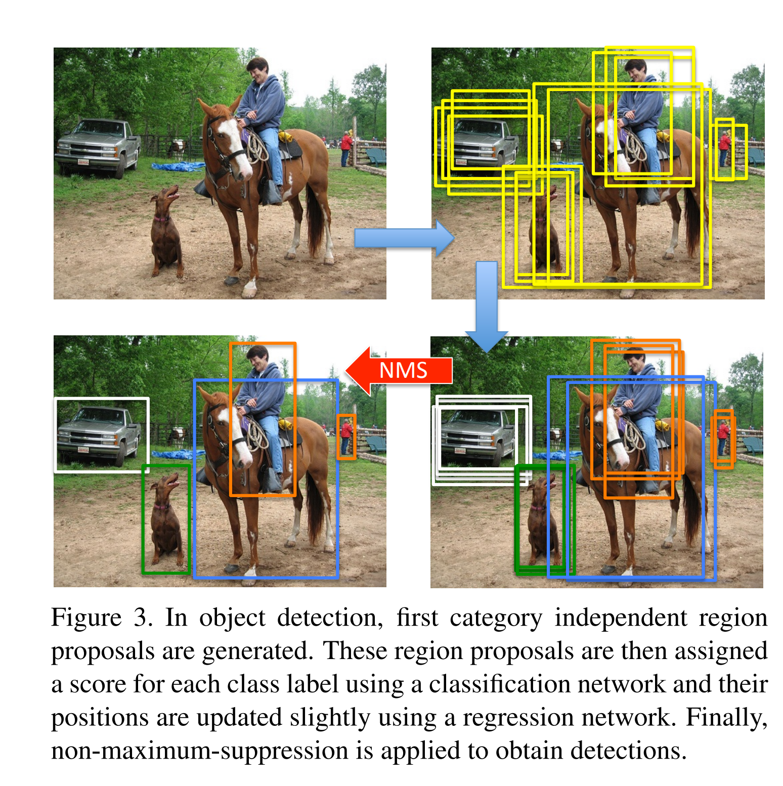
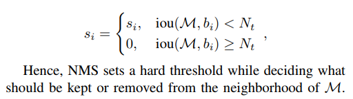
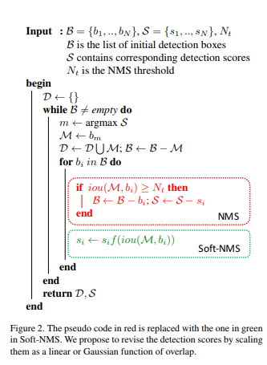
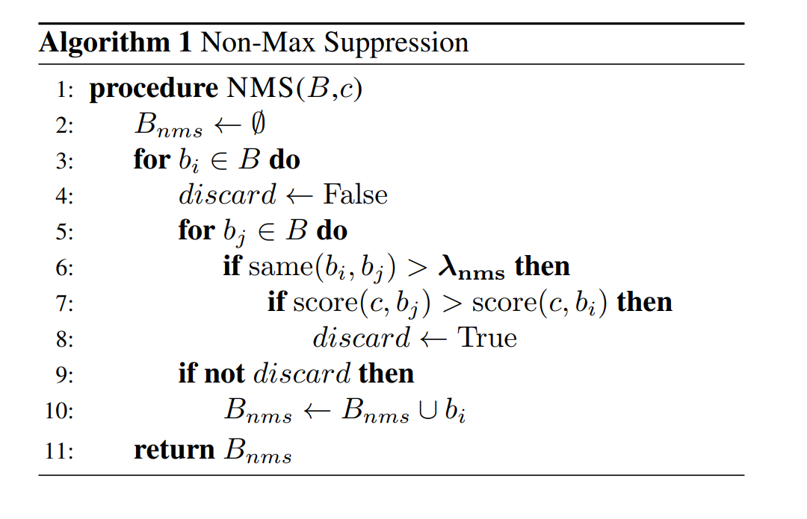

# 非极大值抑制

对于基于anchor框架的目标检测算法，在一个检测的pipeline中，网络中间层输出的Proposal/bounding box，会出现多个Proposal对应一个GT/instance的现象，对于一个instance，在重复的Proposal中必然有一个和它的IoU是最大的。非极大值抑制，NMS（Non-maximum-suppression）算法就是一种合并重复Proposal为一个的算法,它根据空间距离和IoU值完成聚类，对每个cluster保留得分最高的BBox作为检测结果。

* 本质：搜索局部最大值

* 适用场景：多个目标（单个目标取score最大值）

* 算法输入：一幅图的所有候选框,每个框对应的score,阈值$N_t$

* 算法输出： 正确的候选框集合

NMS可以被理解为一个rescore的过程

其中M为当前得分最大的bounding box，Nt为抑制阈值，si为sore。

感兴趣可以看一下soft-NMS 将NMS函数平滑化，其实是一个重打分的过程。

## 算法实现

# reference

NMS https://medium.com/@yusuken/object-detction-1-nms-ed00d16fdcf9

soft NMS https://arxiv.org/pdf/1704.04503.pdf

soft NMS尝试blog https://blog.csdn.net/sum_nap/article/details/81096976