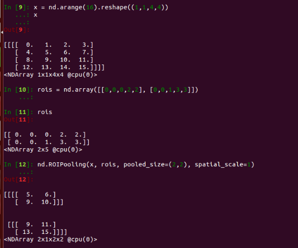
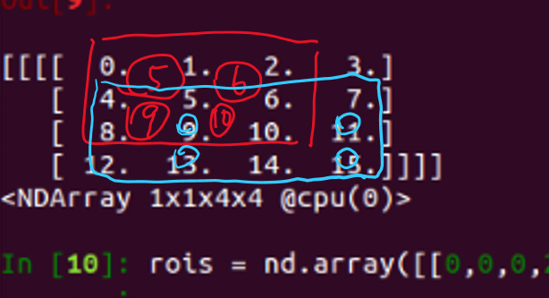

# RoI & SPPNet

## RoI

RoI pooling 首先是在SPPNet和fast-rcnn中被人熟悉 知道
意思是 Region of Interest 指的是在“特征图上的框”；

顾名思义 RoI pooling 首先是一个池化层,是加入在卷积网络中的一层

ROI的特点，就是不管你输入尺寸如何，我的输出尺寸都是固定长度的向量

1）在Fast RCNN中， RoI是指Selective Search完成后得到的“候选框”在特征图上的映射  
2）在Faster RCNN中，候选框是经过RPN产生的，然后再把各个“候选框”映射到特征图上，得到RoIs。

Fast R-CNN论文里也说了 RoI Pooling就是SPPNet的一层
>RoI max pooling works by dividing the hxw RoI window into an HxW grid of sub-windows of approximate size h/H x w/W and then max-pooling the values in each sub-window into the corresponding output grid cell. Pooling is applied independently to each feature map channel, as in standing max pooling.

## SPPNet
SPPNet的名字是Spatial Pyramid Pooling Convolutional Networks 中文是"空间金字塔池化卷积网络" 听起来很高级

实际上,SPPNet就是对一张图做不同尺度的ROI 然后把特征顺序连接起来,这样不管你输入图片多大尺寸，我输出的特征都一样长


# RoI pooling
我们来研究一下 RoI具体是如何实现的

RoI的输入,为任意大小的卷积特征和一系列的区域,输出是固定维数的向量

假设卷积层输出的宽度为$w$,高度为$h$,通道数为$c$.不管输入图像的尺寸是多少,其卷积结果的通道数都不会变,但是$w$和$h$会变化,$c$是一个常数,我们可以不用管它.

输入特征尺寸wxh，对每个区域它将其均匀划分为nxm的小区域，并对每个小区域做最大池化，从而得到一个nxm的输出。因此不管输入区域的大小，RoI池化层都将其池化成固定大小的输出。

我们来用mxnet的[RoI函数](https://mxnet.incubator.apache.org/api/python/ndarray/ndarray.html?highlight=roi#mxnet.ndarray.ROIPooling)试验一下
```
mxnet.ndarray.ROIPooling(
    data=None, 
    rois=None, 
    pooled_size=_Null, 
    spatial_scale=_Null, 
    out=None, 
    name=None, **kwargs
    )
```


假设一张图片我们得到了4x4的特征,通道数为1
```
from mxnet import nd
#batch channel w h
x = nd.arange(16).reshape((1,1,4,4))

```

然后创建两个roi区域
每个区域由一个长为5的向量表示.
第一个元素是其对应的物体的标好,之后分别是
`x_min`，`y_min`，`x_max`，和`y_max`。这里我们生成了$3\times 3$和$4\times 3$大小的两个区域。
RoI池化层的输出大小是`num_regions x num_channels x n x m`。它可以当做一个样本个数是`num_regions`的普通批量进入到其他层进行训练。
```
rois = nd.array([[0,0,0,2,2], [0,0,1,3,3]])
nd.ROIPooling(x, rois, pooled_size=(2,2), spatial_scale=1)
```


## implementation

来看一下mxnet的实现[link](https://github.com/apache/incubator-mxnet/blob/2becd7641fbe264b72425fe6b1ded00cea19d3a8/src/operator/roi_pooling.cc)

可以参考阅读网上的这篇caffe实现的RoI https://blog.csdn.net/lanran2/article/details/60143861

在看源码的时候发现了RoIAlign

可以看一下这篇帖子:[深度学习: 从 RoIPooling 到 RoIAlign](https://blog.csdn.net/JNingWei/article/details/78822159)