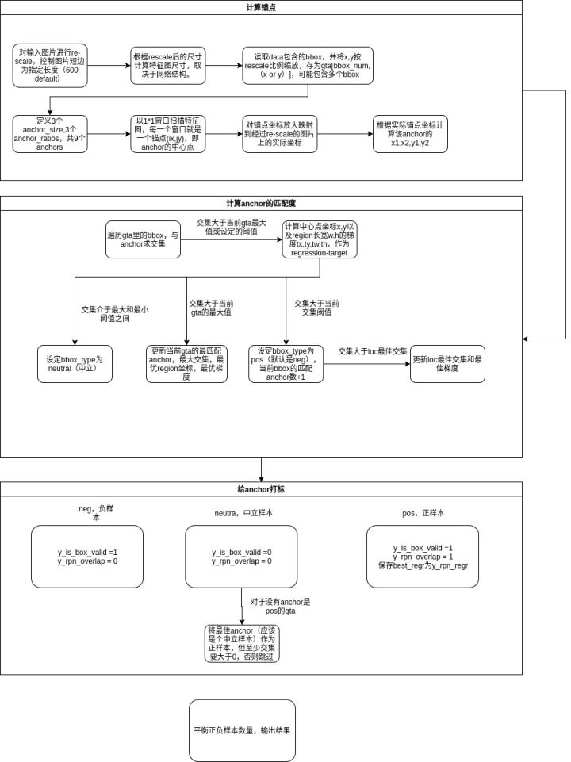

# RPN&anchor

RPN(Region Proposal network)和anchor是Faster RCNN中重要的概念,在其它检测算法中也被频繁地使用,这里简单说一下原理,主要实现一下.

我们曾经在[link](https://github.com/bdus/readcvpaper/blob/master/DET/2/readme.md#rpn)讲Faster-RCNN时候提到了一点,回顾一下:

    
1. 卷积网络抽取的特征首先进入一个填充数为 1、通道数为 256 的 3 × 3 卷积层,这样每个像
素得到一个 256 ⻓度的特征表示。
2. 以每个像素为中心,**生成多个大小和比例不同的锚框和对应的标注**。每个锚框使用其中心
像素对应的 256 维特征来表示。
3. 在锚框特征和标注上面训练一个两类分类器,判断其含有感兴趣目标还是只有背景。
4. 对每个被判断成含有目标的锚框,进一步预测其边界框,然后进入 RoI 池化层。

对于每个anchor,根据其尺寸和特征向量分支出两个全连接层: cls-layer 和 reg-layer
1. cls-layer 输出是bool,用于判断这个Proposal有没有object(是前景还是背景)
2. reg-layer 输出有四个,用于预测proposal的中心锚点对应的(x,y,w,h)

不管懂没懂,先来写一下没有错的.

因此RPN的代码可以拆分一下:
    首先是以每个像素为中心,**生成多个大小和比例不同的锚框和对应的标注** 
    然后是对每个像素提256d特征, 连接cls-layer

# Anchor

参考《动手学习深度学习》http://zh.d2l.ai/chapter_computer-vision/anchor.html

假设输入图像高为h，宽为w。我们分别以图像的每个像素为中心，生成不同形状的锚框。
设锚框大小为 $s \in (0,1]$，且宽高比为$r>0$，锚框的宽和高分别为 $ws \sqrt{r}$ 和$hs\sqrt{r}$。当中心位置给定时，已知宽和高的锚框是确定的。

下面我们分别设定好一组大小 $s1,…,sn$ 和一组宽高比 $r1,…,rm$ 。如果以每个像素为中心时使用所有的大小与宽高比的组合，输入图像将一共得到 $whnm$ 个锚框。
虽然这些锚框可能覆盖了所有的真实边界框，但计算复杂度容易过高。因此，我们通常只对包含 s1 或 r1 的大小与宽高比的组合感兴趣，即

(s1,r1),(s1,r2),…,(s1,rm),(s2,r1),(s3,r1),…,(sn,r1).

也就是说，以相同像素为中心的锚框的数量为 n+m−1 。对于整个输入图像，我们将一共生成 wh(n+m−1) 个锚框。

比如

>scales = [1,3,5] \
ratios = [0.5,1,2]

一共有9种组合
但是与scale=1/ratio=0.5相关的只有n+m-1=5种

实现例子参考[link](https://github.com/bdus/readcvpaper/tree/master/DET/2/rpn)

# RPN的训练

一张图片上的检测结果的数量是不一定的，所以很难像分类一样，有直观的映射。为了建立起GT和输入images的映射，目标检测采取了许多办法。

两阶段法中，FasterRCNN首先RPN得到Proposal，然后ROI预测。

## RPN 输入 输出

### **预测的时候，**

RPN 的输入，是feature map 和 原图

输出的是Proposal框（这个框，数目不等于anchor数目，并非直接预测的结果，而是被选择过的 具体参考原论文或 gluoncv[9.4.3](http://zh.d2l.ai/chapter_computer-vision/anchor.html)）

### **预测的过程中，**

在RPN中 通过anchor机制，完成了目标框选择的过程。

1. 首先， 一张w*h的特征图 产生  wh(n+m−1) 个锚框
2. 然后，对每个锚框预测 类别（这个anchor变换回图片，属于前景 or 背景） 和 偏移量（距离目标GT偏移量）
3. 接着根据预测的偏移量，调整锚框位置，得到预测的边界框
4. 最后筛选边界框 NMS，得到预测的Proposal

也就是说，RPN模型其实是评估了每个anchor变回原图，是否框到了前景，框到了多少，然后筛选出来好的结果。

### **在训练的时候，**

在训练的时候，每个锚框都视为一个训练样本。

也就是说，学习器在作loss的时候，不是直接预测值与和GT做loss

而是 **在每个anchor上的预测** 与 **GT生成的anchor正负样本标签**，在anchor这个框架上，间接的做loss

所以 如何通过GT生成对应的正负样本标签呢？ 参考原文章和[9.4.3](http://zh.d2l.ai/chapter_computer-vision/anchor.html)

也可以看看这个
https://zhuanlan.zhihu.com/p/28585873

