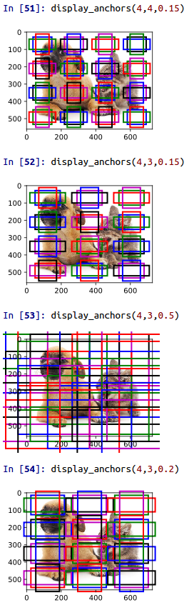
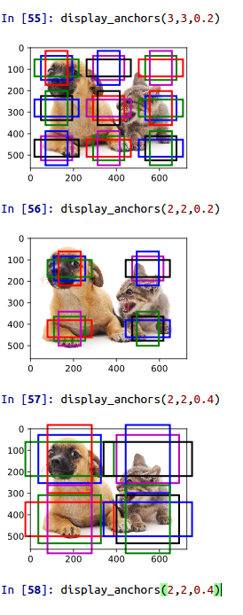
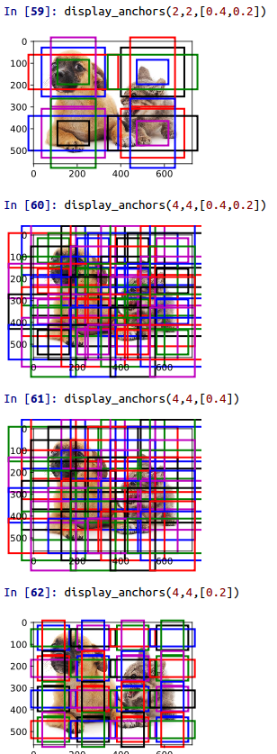

# anchor生成示意图

原图片img首先经过卷积，得到fmap，

这个过程，如果只看尺寸，不看通道等，就仿佛是对img做了下采样

生成anchor的过程 是由一个小的卷积划窗，对fmap的每一个像素，都生成a个预设的窗口

如果fmap的尺寸为[b,c,w，h]那么，生成的窗口数目将与b，c无关，为$wha$个，a通常取值 m*n 或 m+n-1，m和n分别是锚框大小和宽高比类数。

设锚框大小为 $s \in (0,1]$，且宽高比为$r>0$，锚框的宽和高分别为 $ws \sqrt{r}$ 和$hs\sqrt{r}$。当中心位置给定时，已知宽和高的锚框是确定的。

anchor生成后，需要映射回原图上

# code

```python
from mxnet import contrib, image, nd
from matplotlib import  pyplot as plt
import gluonbook as gb

img = image.imread(os.path.join(gbpath,'img/catdog.jpg'))#.asnumpy()
h,w = img.shape[0:2]

def display_anchors(fmap_w, fmap_h, s):
    fmap = nd.zeros((1, 10, fmap_w, fmap_h))  # 前两维的取值不影响输出结果 (因为是按照fmap的w h面每个像素生成a个anchor)
    anchors = contrib.nd.MultiBoxPrior(fmap, sizes=s, ratios=[1, 2, 0.5])  # 按照大小和 比例生成anchors wh(m+n-1)
    # MultiBoxPrior doc https://mxnet.incubator.apache.org/api/python/ndarray/contrib.html?highlight=multibo#mxnet.ndarray.contrib.MultiBoxPrior
    # MultiBoxPrior src https://github.com/apache/incubator-mxnet/blob/master/src/operator/contrib/multibox_prior.cc
    bbox_scale = nd.array((w, h, w, h))
    gb.show_bboxes(gb.plt.imshow(img.asnumpy()).axes,
                    anchors[0] * bbox_scale)

display_anchors(4,4,0.15)
display_anchors(2,2,0.4)

```




```python

def show_bboxes(axes, bboxes, labels=None, colors=None):
    def _make_list(obj, default_values=None):
        if obj is None:
            obj = default_values
        elif not isinstance(obj, (list, tuple)):
            obj = [obj]
        return obj

    labels = _make_list(labels)
    colors = _make_list(colors, ['b', 'g', 'r', 'm', 'c'])
    for i, bbox in enumerate(bboxes):
        color = colors[i % len(colors)]
        rect = d2l.bbox_to_rect(bbox.asnumpy(), color)
        axes.add_patch(rect)
        if labels and len(labels) > i:
            text_color = 'k' if color == 'w' else 'w'
            axes.text(rect.xy[0], rect.xy[1], labels[i],
                      va='center', ha='center', fontsize=9, color=text_color,
                      bbox=dict(facecolor=color, lw=0))
```

# 检测


我们已经输出了anchor，接下来如何做检测呢?

http://zh.d2l.ai/chapter_computer-vision/multiscale-object-detection.html

>既然我们已在多个尺度上生成了不同大小的锚框，相应地，我们需要在不同尺度下检测不同大小的目标。下面我们来介绍一种基于卷积神经网络的方法。

>在某个尺度下，假设我们依据 ci 张形状为 h×w 的特征图生成 h×w 组不同中心的锚框，且每组的锚框个数为 a 。例如，在刚才实验的第一个尺度下，我们依据10（通道数）张形状为 4×4 的特征图生成了16组不同中心的锚框，且每组含3个锚框。 接下来，依据真实边界框的类别和位置，每个锚框将被标注类别和偏移量。在当前的尺度下，目标检测模型需要根据输入图像预测 h×w 组不同中心的锚框的类别和偏移量。

>假设这里的 ci 张特征图为卷积神经网络根据输入图像做前向计算所得的中间输出。既然每张特征图上都有 h×w 个不同的空间位置，那么相同空间位置可以看作含有 ci 个单元。 根据“二维卷积层”一节中感受野的定义，特征图在相同空间位置的 ci 个单元在输入图像上的感受野相同，并表征了同一感受野内的输入图像信息。 因此，我们可以将特征图在相同空间位置的 ci 个单元变换为以该位置为中心生成的 a 个锚框的类别和偏移量。 不难发现，本质上，我们**用输入图像在某个感受野区域内的信息来预测输入图像上与该区域位置相近的锚框的类别和偏移量**。

>当不同层的特征图在输入图像上分别拥有不同大小的感受野时，它们将分别用来检测不同大小的目标。例如，我们可以通过设计网络，令较接近输出层的特征图中每个单元拥有更广阔的感受野，从而检测输入图像中更大尺寸的目标。


注意这一句：

本质上，我们用输入图像在某个感受野区域内的信息来预测输入图像上与该区域位置相近的锚框的类别和偏移量

事实是这样没错，但实际上，虽然由a种anchor，检测器是不知道anchor长什么样子的。

# reference

参考mxnet教程
http://zh.d2l.ai/chapter_computer-vision/multiscale-object-detection.html