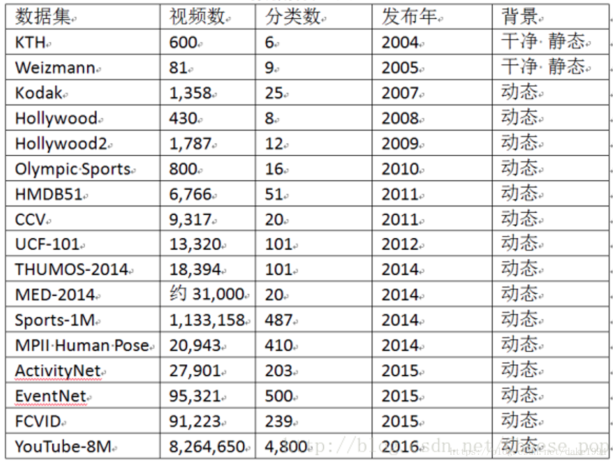
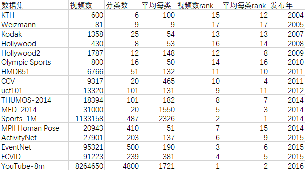

# 矛盾

在开源数据集上获得的效果,最终都要在实际数据集上进一步进行实验，最后要在实际环境中进行验证。

而巧妇难为无米之炊，实际验证必须要有合适的验证数据集。

# 视频分类数据集介绍

在视频分类项目中，有很多经典的公开数据集，目前主要的数据集如列表所示：

如果有了实际数据集，就可以在此之上进行迁移学习。

# 迁移学习

深度网络的finetune也许是最简单的深度网络迁移方法。Finetune 也叫微调、finetuning。Finetune就是利用别人已经训练好的网络，针对自己的任务再进行调整。

在实际的应用中，我们通常不会针对一个新任务，从头开始训练一个神经网络，更关键的是，我们的训练数据集很难和开源数据集ImageNet那么大，可以训练出泛化能力足够强的深度神经网络。

通过使用迁移学习，我们可以利用之前已经训练好的模型，将它很好地迁移到自己的任务上即可。

为什么需要finetune

别人训练好的模型，可能并不是完全适用于我们自己的任务。可能别人的训练数据和我们的数据之间不服从同一个分布；可能别人的网络能做比我们的任务更多的事情；可能别人的网络比较复杂，我们的任务比较简单。

举个例子来说，

UCF101数据集从YouTube收集而来，共包含101类动作。其中每类动作由25个人做动作，每人做4-7组，共13320个视频，分辨率为320*240。UCF101在动作的采集上具有非常大的多样性，包括相机运行、外观变化、姿态变化、物体比例变化、背景变化、光纤变化等。101类动作可以分为5类：人与物体互动、人体动作、人与人互动、乐器演奏、体育运动

而华为行为检测项目中，数据从车内部的摄像头而来，显然和UCF101的数据集的分布不同，一个是网络视频，一个是摆拍视频。其次，检测项目中只包含吸烟、打电话、分神、驾驶员异常、驾驶员正常等几个类别，显然要比UCF101的类别要少。

finetune的有明显的优势：

    不需要针对新任务从头开始训练，节省时间
    预训练的模型通常都是在大数据集上进行的，无形中扩充了我们的训练数据，使得模型更鲁棒、泛化更好
    finetune实现简单，只需要关注自己的任务就好。

finetune也有它自己的先天不足：它无法处理训练数据和测试数据分布不同的情况。而这一现象，在实际应用中比比皆是。

# 需要什么样的数据集

以结果为导向，最后的数据集需要符合几个特征：

1. 数据要服从相同的分布

    服从相同的分布简单可以理解为数据来源的渠道一样，风格类似
    
    同样是异常行为检测的图像，采用红外摄像机拍摄和采用光学摄像机拍摄的分布就是不同的

    同样是异常行为检测的数据集，一批从车辆的正前方对着驾驶员脸录制的视频，和另一批从侧方对驾驶员录制的视频的分布也是不同的

    因此，在确定了采集数据的方式后，同一批数据集应该是有着相同的采集方式和采集环境的，否则就是不服从相同分布的。采集方式包括使用的传感器、摄像机、是从车的哪个角度录制等；采集环境包括采集时汽车是启动还是停止、驾驶员是真实驾驶员还是摆拍驾驶员、拍摄光线强度、背景

2. 数据集需要有足够的信息

    首先数据需要由足够的量，其次数据需要由一定的多样性

    前者就是数据的每一类需要有足够的种类 具体数目参考标准数据集 做了一些分析：

    

    多样性就是说 每一类要有足够的多样性，视频可以不长，但是每段视频如果人物、环境、行为都没有改变，视频前后一致，并没有带来足够有效的信息可以训练

3. 类别要均衡

    各类数据应该不应该在数量上差别很大

# 怎样采集数据

首先建立前车图像采集系统，收集训练样本并进行人工标注

然后需要数据的[标准化](https://blog.csdn.net/Jesse_Mx/article/details/72599220)
和进行数据增强