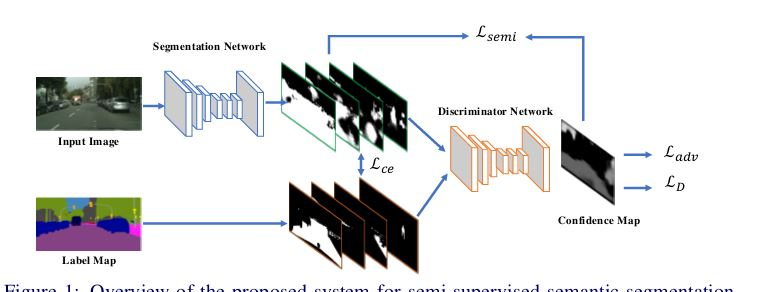

# 子文件夹
半监督目标检测相关

[link](./semi_obj/readme.md)

# 此目录下

## Adversarial Learning for Semi-Supervised Semantic Segmentation

基于对抗训练的半监督语义分割

这篇文章句子都够长，读起来就感觉出自国人。。。

1. 用全卷积实现了 feature map到gt的辨别的discriminator网络，并且考虑了分辨率的问题
2. 这个全卷积的discriminator 网络能够在无标签数据中找到可信区域，籍此可实现半监督

discriminator的输出是置信map 每个像素上的值是[0,1]

具体可以看论文4.2介绍loss的

# meta-learning for semi-supervised few-shot classification
