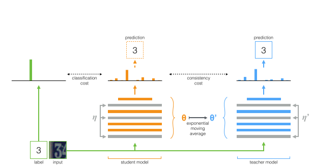

# mean teacher

半监督 mean teacher 是17年提出来的半监督方法：
>Mean teachers are better role models: Weight-averaged consistency targets improve semi-supervised deep learning results

[arxiv](https://arxiv.org/abs/1703.01780)

改进了Temporal ensembling 和 $\Pi$ model

主要工作在于通过权重平均的方法来更新teacher参数，而不是简单的replicating student

## 算法

算法的整体包括两个网络，teacher网络 和 student网络
teacher 是 student网络的一份复制，因此网络结构相同，但是网络更新的方式不同，因此是两个独立的网络

其中 student模型 权重 $\theta$ 输入噪声$\eta$, 
teacher模型 权重 $\theta'$ 输入噪声$\eta'$

定义了一致性损失（consistency cost) J 衡量 t和s 的预测的距离

$$
J(\theta)=\mathbb{E}_{x,\eta',\eta}\left [
    \left \|
        f(x,\theta',\eta') - f(x,\theta,\eta)
    \right \| \right ]
$$

student通过梯度下降更新参数，teacher通过student的参数更新
>原文:After the weights of the student model have been updated with gradient descent, the teacher model weights are updated as an exponential moving average of the student weights.

1. teacher的参数更新
   
mean teacher 相比Temporal ensembling 和 $\Pi$ model 的创新主要就在这里:
>原文:The difference between the Π model, Temporal Ensembling, and Mean teacher is how the teacher
predictions are generated. Whereas the Π model uses θ = θ, and Temporal Ensembling approximates
f (x, θ , η ) with a weighted average of successive predictions,

teacher的参数通过EMA得到

training step $\theta_t$:

$$
\theta_t = \alpha\theta_{t-1}^{'} + (1-\alpha)\theta_t
$$

2. student的参数更新

论文里面说student参数更新是SGD，并没有具体的算法loss表达和流程，
只在图例描述了过程，说了和Temporal ensembling 、 $\Pi$ model一样 

网上有[blog](https://blog.csdn.net/hjimce/article/details/80551721)
做了总结 但是也不详出处

所以我们还是看一下[$T$](https://arxiv.org/pdf/1610.02242.pdf)和$\Pi$两篇文章

## 代码

代码用的tf版本比较老，最好用1.2.1版本去跑

https://github.com/CuriousAI/mean-teacher/blob/master/tensorflow/mean_teacher/model.py

# reference

Mean teachers are better role models: Weight-averaged consistency targets improve semi-supervised deep learning results

深度学习（七十四）半监督Mean teachers
https://blog.csdn.net/hjimce/article/details/80551721

TEMPORAL ENSEMBLING FOR SEMI-SUPERVISED LEARNING
https://arxiv.org/pdf/1610.02242.pdf