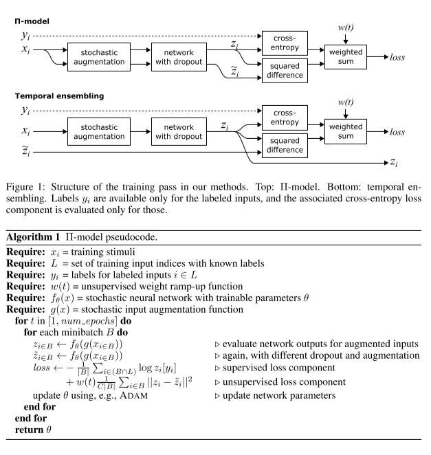
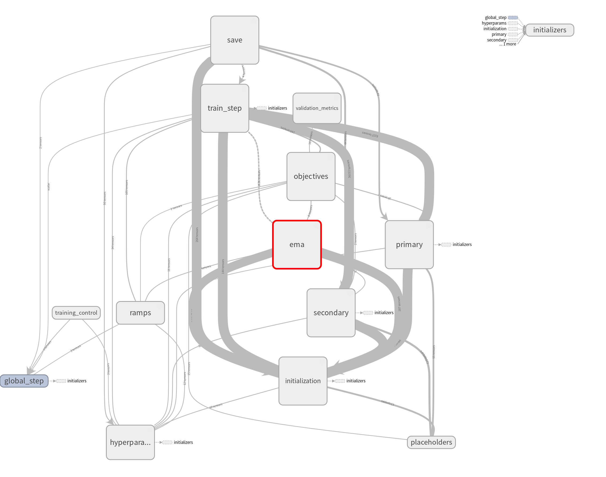

# mean teacher

半监督 mean teacher 是17年提出来的半监督方法：
>Mean teachers are better role models: Weight-averaged consistency targets improve semi-supervised deep learning results

[arxiv](https://arxiv.org/abs/1703.01780)

改进了Temporal ensembling 和 $\Pi$ model

主要工作在于通过权重平均的方法来更新teacher参数，而不是简单的replicating student

## 算法思路

算法的整体包括两个网络，teacher网络 和 student网络
teacher 是 student网络的一份复制，因此网络结构相同，但是网络更新的方式不同，因此是两个独立的网络

其中 student模型 权重 $\theta$ 输入噪声$\eta$, 
teacher模型 权重 $\theta'$ 输入噪声$\eta'$

定义了一致性损失（consistency cost) J 衡量 t和s 的预测的距离

$$
J(\theta)=\mathbb{E}_{x,\eta',\eta}\left [
    \left \|
        f(x,\theta',\eta') - f(x,\theta,\eta)
    \right \| \right ]
$$

student通过梯度下降更新参数，teacher通过student的参数更新
>原文:After the weights of the student model have been updated with gradient descent, the teacher model weights are updated as an exponential moving average of the student weights.

### 1. teacher的参数更新
   
mean teacher 相比Temporal ensembling 和 $\Pi$ model 的创新主要就在这里:
>原文:The difference between the Π model, Temporal Ensembling, and Mean teacher is how the teacher
predictions are generated. Whereas the Π model uses θ = θ, and Temporal Ensembling approximates
f (x, θ , η ) with a weighted average of successive predictions,

teacher的参数通过EMA得到

training step $\theta_t$:

$$
\theta_t = \alpha\theta_{t-1}^{'} + (1-\alpha)\theta_t
$$

### 2. student的参数更新

论文里面说student参数更新是SGD，并没有具体的算法loss表达和流程，
只在图例描述了过程，说了和Temporal ensembling 、 $\Pi$ model一样 

所以我们还是结合一下[Temporal ensembling](https://arxiv.org/pdf/1610.02242.pdf)

## 训练

看过$\Pi$ model 我们来重新理解一下mean teacher

上图是 单个标签的训练样本的例子
student和teacher模型都接收同一个输入x分别加上不同的噪声$\eta,\eta'$
然后student模型的softmax输出 (1)首先和one-hot label做交叉熵（classification cost function），(2)同时和teacher模型做一致性cost function（$J(\theta)$）. 这样student的权重更新以后，根据其权重，指数滑动平均EMA来更新teacher. s和t都可以用于预测，但是t可能更好。在u集上的训练类似，除了没有classification cost function.

结合Temporal ensembling来看，就很好理解了

网上有[blog](https://blog.csdn.net/hjimce/article/details/80551721)
做了总结，我们还是看官方的[link](https://github.com/CuriousAI/mean-teacher#approach)：

Mean Teacher is a simple method for semi-supervised learning. It consists of the following steps:

1. Take a supervised architecture and make a copy of it. Let's call the original model the student and the new one the teacher.
2. At each training step, use the same minibatch as inputs to both the student and the teacher but add random augmentation or noise to the inputs separately.
3. Add an additional consistency cost between the student and teacher outputs (after softmax).
4. Let the optimizer update the student weights normally.
5. Let the teacher weights be an exponential moving average (EMA) of the student weights. That is, after each training step, update the teacher weights a little bit toward the student weights.

Our contribution is the last step. Laine and Aila [paper](https://arxiv.org/abs/1610.02242) used shared parameters between the student and the teacher, or used a temporal ensemble of teacher predictions. In comparison, Mean Teacher is more accurate and applicable to large datasets.

# 代码

代码用的tf版本比较老，最好用1.2.1版本去跑

https://github.com/CuriousAI/mean-teacher/blob/master/tensorflow/mean_teacher/model.py

tf代码看的似懂非懂的。。
计算图长这样

// 填坑

# reference

Mean teachers are better role models: Weight-averaged consistency targets improve semi-supervised deep learning results

深度学习（七十四）半监督Mean teachers
https://blog.csdn.net/hjimce/article/details/80551721

TEMPORAL ENSEMBLING FOR SEMI-SUPERVISED LEARNING
https://arxiv.org/pdf/1610.02242.pdf