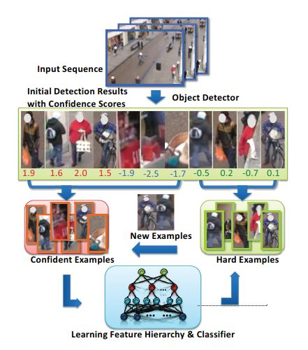

## semi-supervised Learning of Feature Hierarchies for Object Detection in a Video

这篇文章较早 2013年
文中的半监督实现方法是通过人工re-score hard examples(难样本 并将rescore后的难样本重新训练

1. 首先用原始的检测器检测视频 获取一些候选的检测结果及对应的score 将这些样本分为置信正样本、置信负样本、难样本
2. 用置信样本学习针对该视频的特征 video-specific
3. 利用学习到的video-specific特征对难样本重新打分
4. 将打分过的 高置信度的一部分难样本放入置信正样本、置信负样本集重新学习特征
5. 重复1-4直到hard example中没有置信样本

# Adaptive Learning for Celebrity Identification With Video Context

这一篇 2014年 视频中的名人识别

自己做的数据集，
关键假设是faces in the same video track share the same identity
>Once a frame within a track is recognized confidently， the label can be propagated through the whole track

但是这种操作需要鲁棒、置信的跟踪
提出 related-sample ——一种介于 标记和未标记的中间态
