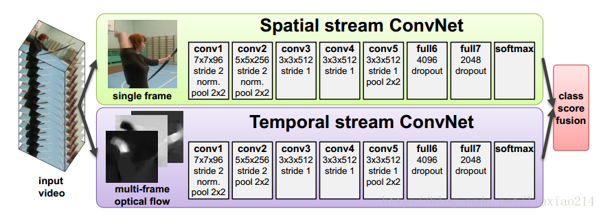
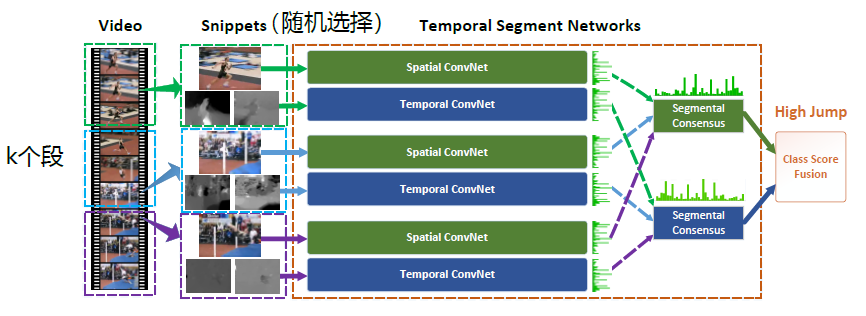

[TOC] 

# 任务定义

对视频中打电话、分神、抽烟、驾驶员消失等危险驾驶行为的检测识别属于**行为检测**(Action Detection)与**行为识别**(Action Recognition)任务。

行为识别就是对时域预先分割好的序列判定其所属行为动作的类型，即“读懂行为”，本质上就是**视频分类**。

而现实应用中更容易遇到的情况是序列尚未在时域分割，因此需要同时完成行为动作在视频中的定位和类型判定。这一类任务就被称为 **行为检测**。

# 视频分类综述

行为识别方法有几个关键点。其一是保证强有力的特征：即如何在视频中提取出能更好的描述视频判断的特征。通过实验观察到特征越强，模型的效果通常较好。相反特征越弱，模型效果就不是那么明显。其二是特征的编码（encode）与融合（fusion）：这一部分包括两个方面，第一个方面是非时序的，在使用多种特征的时候如何编码或融合这些特征以获得更好的效果；另外一个方面是时序上的，由于视频很重要的一个特性就是其时序信息，一些动作看单帧的图像是无法判断的，只能通过时序上的变化判断，所以需要将时序上的特征进行编码或者融合，获得对于视频整体的描述。

行为识别除了要利用视频的帧信息还要利用视频的帧间信息。我们这里介绍的方法都是直接输入视频光学图像，此外还有一些网络的输入是人体的骨骼。

## 传统方法

在深度学习兴起之前，传统的方法能够利用的帧间信息主要就是光流信息，帧信息主要就是基于图像的特征信息。密集轨迹算法(iDT, improved dense trajectories)是传统方法效果最好的一种。DT算法的基本思路是利用光流场来获得视频序列中的一些轨迹，再沿着轨迹提取HOF、HOG、MBH、trajectory四种特征，最后利用FV（Fisher Vector）方法对特征进行编码，再基于编码结果训练SVM分类器。iDT改进的地方在于它利用前后两帧视频之间的光流以及SURF关键点进行匹配，从而消除/减弱相机运动带来的影响，改进后的光流图像被成为warp optical flow。

## 深度学习

在深度学习兴起之后，帧信息由图像分类网络提取的特征图代替，主要区别在于如何利用帧间信息，主要分为基于光流的方法和基于3D卷积的方法。

**双流网络** [^1] (Two Steam ConvNet)以光流的形式利用帧间信息。在空间部分，以单个帧上的外观形式，携带了视频描绘的场景和目标信息。其自身静态外表是一个很有用的线索，因为一些动作很明显地与特定的目标有联系。在时间部分，以多帧上的运动形式，表达了观察者（摄像机）和目标者的运动。因此，对视频中每两帧计算密集光流，得到密集光流的序列，然后对于视频图像和密集光流分别训练CNN模型，两个分支的网络分别对动作的类别进行判断，最后对两个网络的结果进行融合和分类，得到最终的分类结果。

对于双流有许多改进，其中最成功的工作是**TSN** [^2] (Temporal Segment Networks)，其改进了输入数据的类型，尝试了RGB Image、Optical Flow Field、RGB Diff、Warped Optical Flow等输入；尝试了backbone的网络结构，包括跨模态、正则化、数据增强等。UCF101-94.2%，HMDB51-69.4%。

此外还有TSN分别在特征融合[^3]、关键帧、Attention、RNN和LSTM等改进版本。 

# paper list

# reference

[^1]: Two-Stream Convolutional Networks for Action Recognition in Videos

[^2]: Temporal Segment Networks: Towards Good Practices for Deep Action Recognition

[^3]: Deep Local Video Feature for Action Recognition 

